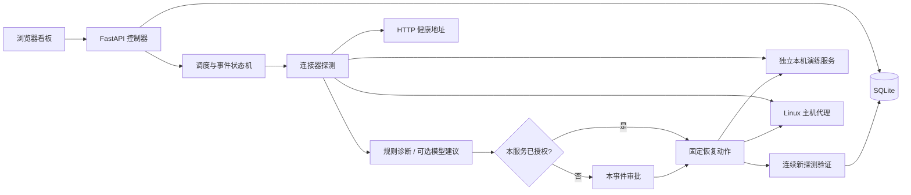

# 架构与恢复边界

OpsSentinel 的职责是持续检查已登记服务，并把可处理的故障推进到有后续探测证据的恢复结果。模型按诊断需求调用，调度与状态独立于模型会话保存。

## 组成

| 模块 | 责任 |
| --- | --- |
| API 与看板 | 登记服务、显示证据、接收具体事件审批、显示执行结果 |
| Engine | 到期扫描、异常阈值、去重、动作调度、冷却、持续验证 |
| Analyzer | 依据结构化事实与日志建议固定枚举动作；默认规则、可选模型 |
| Store | 保存服务策略、探测、事件、动作尝试与时间线 |
| Connectors | 对不同环境提供统一 `observe` 与 `execute` 接口 |
| Host agent | 使用本地配置允许列表访问固定 Compose 服务并执行受控动作 |

## 从异常到恢复

正常服务达到连续失败阈值才建立事件。一个服务只保留一个活跃事件；之后的失败为同一事件补充证据，避免每轮重复建单。

| 状态 | 含义与后续 |
| --- | --- |
| `investigating` | 收集事实，生成诊断与动作建议 |
| `awaiting_approval` | 动作需要本事件的人工审批；其他服务继续扫描 |
| `remediating` | 已登记动作尝试，正在执行固定动作 |
| `verifying` | 动作返回后等待新的健康与业务探测 |
| `resolved` | 达到连续恢复阈值，保存恢复证据和恢复类型 |
| `escalated` | 达到重试上限、动作状态不明、无法安全恢复或操作员结束处理 |

动作返回 `ok` 不能直接把事件标记为 `resolved`。重启、回滚只缓解故障，记录中的 `resolution_kind=mitigated` 不等于代码缺陷得到根治。忽略事件也不等于恢复。

操作员审批只针对当前事件的当前动作。执行前重新检查服务，避免对已自然恢复的服务继续操作。尝试次数受限，冷却期间仍可更新事实；没有证据支持的动作不会由模型自由扩展。

停止事件后，手动扫描只补充观察，不会清除停止标记或重新开启处置。`escalated` 事件继续接受健康观察，外部恢复达到阈值后可以结案；系统不通过手动扫描重放结果不明的动作。

## 持久化与崩溃恢复

SQLite 是任务状态依据，聊天历史不是任务数据库。动作尝试应先写入，再调用外部执行接口。每次外部动作有稳定的 `operation_id`，代理保存幂等记录。

普通探测按服务保留最近 200 条；每个事件另行固化首次异常、动作前探测和最终恢复探测，避免关键证据随普通观察记录滚动清理而丢失。

控制器重启后，验证中的事件继续等待新探测；执行中断且结果无法确认的事件转为需要检查的状态，不盲目重做。幂等记录只能避免已记录动作重复执行，不能使所有外部副作用变成跨系统原子事务；不确定状态必须保留。

同一服务的状态变更串行化，并发执行受全局 Worker 上限控制。建议一个 SQLite 数据目录只由一个控制器进程使用。备份需同时覆盖 SQLite 数据与所需运行状态，升级前先停止该实例或使用一致性备份方式。

## 两层动作授权

1. 控制器的服务策略决定某动作自动执行还是等待审批。
2. 主机代理的本地允许列表决定这个服务实际上可以执行哪些动作，以及操作对象和参数。

动作集合仅包含 `restart_service`、`rollback_release`、`restore_config`、`rotate_logs`。HTTP 连接器只观察。模型与日志不能提供新命令、修改代理允许列表或提升权限。

主机代理调用 Docker CLI 时使用参数数组与超时，不执行拼接 Shell。回滚要求当前/上一镜像的固定摘要、时间窗口内的新容器、失败的业务探针、上一镜像已在本机及数据兼容声明。配置恢复要求允许列表中的受管文件、已知备份与匹配的 SHA-256；原文件归档后进行原子替换，再校验 Compose 配置并只重建指定服务。日志轮转只能作用于配置允许的专用日志文件。代理不提供任意读文件、删除目录、清理卷或修改整个 Docker daemon 的接口。动作的详细前提以 [主机代理文档](host-agent.md) 和实际配置校验为准。

代理用 SQLite 唯一约束阻止同一服务跨进程并发写操作。执行中断或结果不明时保留持久化占用，换一个操作 ID 也不能继续写该服务；需要先人工核查，不自动释放这种不确定状态。

## 接口与认证

- 默认控制器地址为 `127.0.0.1:8765`；非回环监听要求至少 24 字符的 `OPS_API_TOKEN`，实际访问域名/IP 需加入 `OPS_ALLOWED_HOSTS`。
- 配置控制器 Token 后，除健康检查外的 API 均验证 Bearer Token。
- 状态改变请求同时要求 `X-OpsSentinel-Request: dashboard`，不开放通配 CORS。
- 看板通过带认证请求的 SSE 或轮询接收状态，Token 仅保存在浏览器 `sessionStorage`。
- API 状态与日志输出不应暴露代理 Token；主机代理使用独立的 `OPS_AGENT_TOKEN`。
- 代理凭据随服务配置保存在 SQLite 中，环境变量引用也会在加载时解析并存储；本版不提供静态加密，应限制状态目录与备份访问权限。
- 原始服务日志作为不可信数据读取，界面用文本节点渲染，不执行日志中的 HTML 或指令。

## 当前不覆盖

本版不实现自动源代码修复、PR 工作流、生产发布编排、跨地域高可用控制器、自动数据库迁移回滚或任意服务器 Shell 运维。启用模型也不会增加这些能力。

主机代理容器若需要访问 Docker socket，其运行权限等价于相应 Docker 管理权限；控制器镜像与 Compose 示例不请求该权限。真实服务的回滚兼容性、网络可达性与恢复条件需要服务负责人分别配置和验证。
